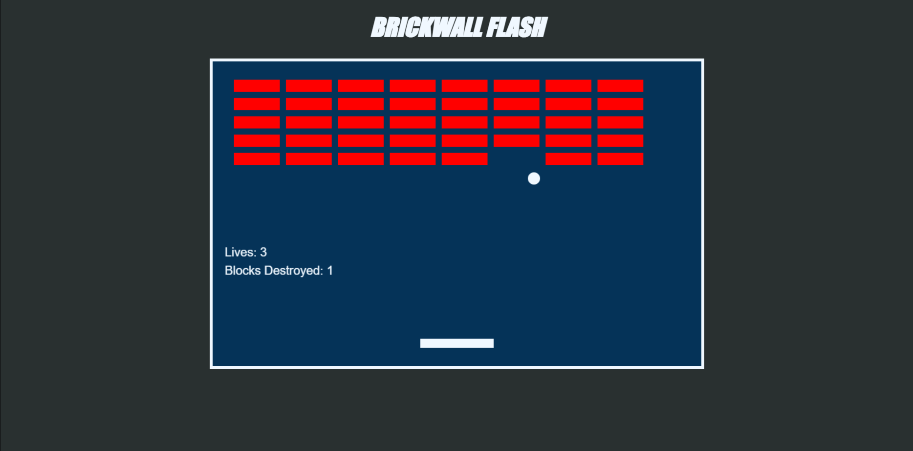

# BRICKWALL FLASH

## Descripción
Un juego estilo 'breakout', desarrollado en JavaScript, CSS e integrado dentro de un HTML.

## Objetivo
Destruye todos los bloques mostrados en pantalla, prediciendo a dónde botará tu pelota, para que la puedas guiar con tu paddle. No pierdas tus vidas, pues no son infinitas!

## Controles
- Usa la *Left Arrow* para moverte a la izquierda
- Usa la *Right Arrow* para moverte a la derecha
- Usa la *Space Bar* en cuanto termines el juego (victoria o derrota) para volver a jugar

## Reglas
- La pelota puede rebotar con las paredes, el techo, y por supuesto, tu paddle
- Si la pelota no alcanza a tocar el paddle, y se va por debajo, pierdes una vida
- Tienes un total de **3 vidas**
- Cada bloque desaparece al contacto con la pelota
- Revisa tu progreso con los marcadores del juego
- El juego termina cuando:
    - Logras destruir todos los bloques con vidas restantes (NICE WIN)
    - Te acabas tus 3 vidas (GAME OVER)

## Startup
Simplemente abre [breakout.html](breakout.html) en tu browser de preferencia, y disfruta del juego!

## Features
- Grid de bloques costumizable (filas y columnas)
- Tableros con scores
- Sistema de reinicio

## Resources
- HTML
- CSS
- JavaScript
